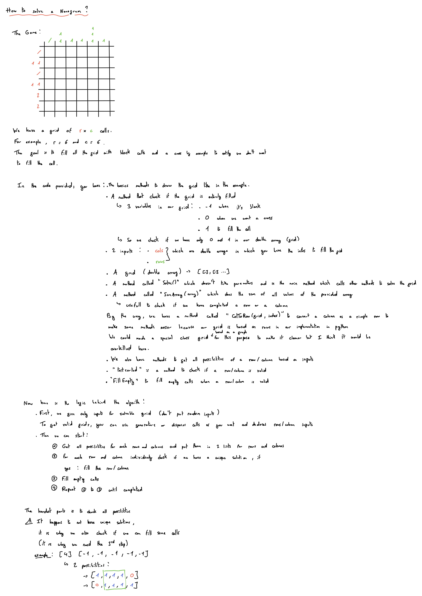

# Nonogramme-Solver

This project was made in 2 days, it is only for studiying and challenging purpose and entertainment.
I have no pretention of getting an optimized solution, but the code works fine.

If you want more precision, feel we free to go throughout the code or reading my little paper I've wrote for a friend.

